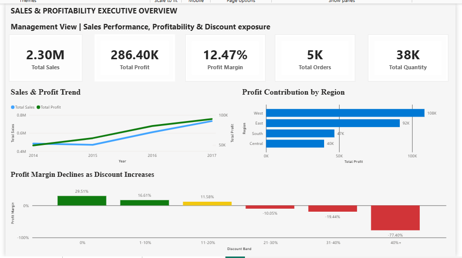
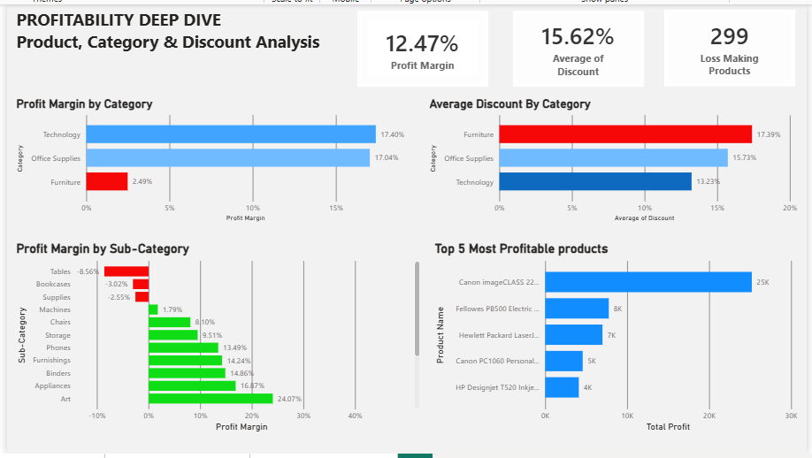
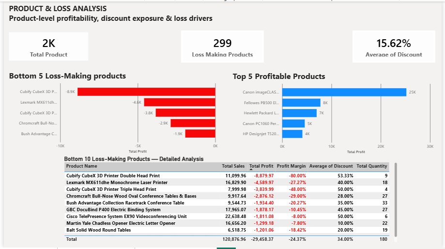

# Sales Performance & Profitability Analysis

**Business Analyst Case Study | SQL + Power BI**

## Business Problem

The business has strong sales, but profitability is not equally strong.

**Business question:**

> Why are sales relatively strong while profitability remains comparatively weak?

I investigated regional performance, category and sub-category profitability, discount exposure, and product-level losses.

---
## My Approach

**Business Problem → Data Quality → SQL Analysis → Root Cause → Recommendations → Power BI**

### Key Questions

- Which regions have a sales-to-profit gap?
- Which categories and sub-categories affect profitability?
- How does profitability change as discount increases?
- Which products create the largest losses?
- What actions could management take?

---

## Key Findings

### 1. Furniture is the weakest category

Furniture generated strong sales but had a much lower profit margin than Technology and Office Supplies.

### 2. Tables are the main sub-category problem

Tables generated approximately **$206.97K in sales but lost approximately $17.73K**, resulting in a **-8.56% profit margin**.

### 3. Higher discounts are associated with weaker profitability

Profit margin deteriorated as discount levels increased, with higher discount bands becoming loss-making.

### 4. Losses are concentrated

The largest product-level losses are concentrated in a relatively small group of products, making targeted review more useful than applying a blanket action.

> **Important:** The analysis identifies strong relationships in the available data. It does not claim that discounting alone causes the losses because product cost, returns, inventory and other operational variables were not available.

---

## Root-Cause Drill-Down

**Furniture → Tables → Discount Exposure → Regional Differences**

I did not stop at identifying Furniture as the weak category.

I drilled down through:

1. Category
2. Sub-category
3. Discount band
4. Region
5. Individual products

This narrowed the business problem to specific areas that management can investigate.

---
## Recommendations

- Review high-discount Tables transactions.
- Introduce appropriate discount approval controls.
- Review products with the largest absolute losses.
- Investigate regional discount practices where margins are weakest.
- Review pricing, cost and product mix for Furniture/Tables.
- Monitor sales, profit, margin, discount and loss-making products through Power BI.

---
# Power BI Dashboard

## Executive Overview

Management view of sales, profit, margin, regional contribution and discount exposure.

## Profitability Deep Dive

Category, sub-category, discount and product profitability analysis.

## Product & Loss Analysis

Bottom loss-making products, top profitable products and detailed product-level evidence.

---

# Data Quality

The source dataset contained **9,994 records**, while the MySQL analysis table contained **9,694 records**.

I identified this **300-record difference during validation** and documented it as a limitation rather than ignoring it.

Other checks included duplicate investigation, missing-value checks and date handling.

---
# Tools

- **MySQL / SQL** — business analysis and validation
- **Power BI** — dashboard and visual analysis
- **Excel / Word** — documentation
- **GitHub** — project versioning and portfolio evidence

---

# Project Evidence

The repository contains supporting evidence showing how the case study was developed:

- Business problem and objectives
- Data dictionary
- Data profiling
- SQL analysis and findings
- Business recommendations
- Stakeholder analysis
- Dashboard requirements
- Power BI dashboard screenshots
- Final portfolio case study
- Sprint documentation

The Sprint evidence is retained so the complete BA workflow can be reviewed when required.

---

# What I Learned

This project helped me practise turning a broad business question into measurable analysis, validating data before using it, drilling from high-level KPIs into root causes, and translating findings into practical recommendations.

**Key BA lesson:** High sales do not automatically mean healthy business performance. The important question is where revenue is failing to translate into profit, and what management can realistically do about it.
